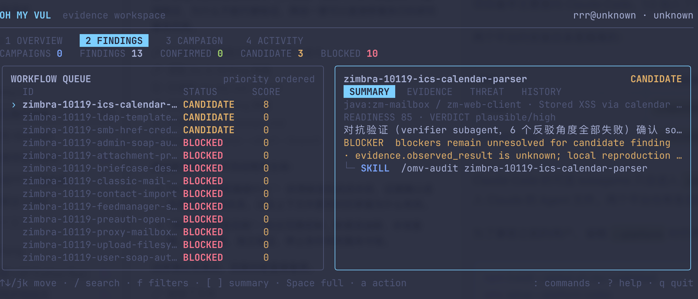

最近把 [oh-my-vul](https://github.com/bx33661/oh-my-vul) 正式发到了 1.0，这个项目也算完成了第一个比较稳定的版本。

我之前一直在用 Claude Code、Codex 这一类 Coding Agent 做代码审计和漏洞研究。现在模型找危险函数、读调用链、写 PoC 的能力已经很强了，但实际用下来，最麻烦的地方往往不是“找不到 sink”，而是研究过程很容易断掉：测试版本在一次对话里，数据流在另一段上下文里，复现结果留在终端历史中，最后生成报告时，模型又会把中间没有确认的部分补成一段非常流畅的结论。

流畅不等于证据完整。代码中出现 `eval`、`innerHTML`、文件读取、命令执行，或者一个没有白名单的 URL，只能说明这里值得继续调查。要把它写成漏洞，至少还得回答几个问题：输入是否由攻击者控制，数据能不能抵达危险操作，中间有哪些转换，guard 是否有效，影响版本是什么，本地运行后到底观察到了什么。

oh-my-vul 主要就是为了解决这个问题。我对它的定位很简单：**让 Agent 负责理解代码，让程序负责约束状态，让研究员保留最后的判断权。**

## 项目最初的样子

项目最开始只有两个 Skill，一个负责寻找值得审计的开源项目，另一个负责把确认后的问题整理成 VulDB、CVE、GHSA、OSV 或 Markdown 报告。

```text
vuln-finder -> vuldb-report
```

这个分工比“扫描完成后直接生成 CVE”要合理一些，因为发现阶段需要尽量扩大搜索，报告阶段则应该收紧结论。但是两个 Skill 之间仍然依赖自然语言交接，Finder 给出一段看起来很完整的分析，Reporter 却很难判断哪些字段来自源码，哪些只是推测。

比如一条 finding 最少会涉及这些内容：

| 证据            | 需要回答的问题                     |
| --------------- | ---------------------------------- |
| Tested version  | 实际检查的是哪个版本               |
| Source          | 哪个输入可以被攻击者控制           |
| Sink            | 数据最后到达了什么危险操作         |
| Guard           | 中间是否存在校验、编码、鉴权或沙箱 |
| Reproducer      | 如何在本地重新触发                 |
| Observed result | 真实运行后看到了什么               |
| Dedup           | 是否已经存在 CVE、GHSA 或生态公告  |

只要其中一项在对话交接时被省略，后面的报告就可能建立在一份过度整理的摘要上。模型写得越像正式报告，反而越难看出中间缺了什么。

## Evidence.v1

后面我加入了 Evidence.v1，把 finding 从一段自然语言变成一个有明确字段和生命周期的研究对象。

一份简化后的 Evidence 大概是这样：

```yaml
schema: Evidence.v1
id: demo-package-path-traversal
status: candidate

package:
  ecosystem: npm
  name: demo-package
  tested_version: 1.2.3

evidence:
  source: request.params.filename
  sink: fs.readFile(...)
  guard: unknown
  reproducer: unknown
  observed_result: unknown

verdict:
  exploitability: plausible
  confidence: medium

blockers:
  - guard bypass has not been demonstrated
  - local reproduction is incomplete
```

这里我比较看重 `unknown`。在普通报告里，它看起来像“还没写完”；在研究流程中，它其实非常重要，因为 unknown 可以阻止模型把推测继续向下传递。

例如 reproducer 已经写出来了，但研究员还没有真实执行，此时 `observed_result` 就应该继续保持 unknown。又或者 source 确实可以到达 sink，但默认的路径规范化已经把攻击截断，那么这条 finding 应该进入 `blocked`，而不是因为“已经找到危险函数”就被提升为 confirmed。

`blocked` 也不代表研究失败。它准确记录了路径断在哪里，后面再打开这个项目时，就不需要围绕同一个 sink 重走一遍。

## Skills 和 CLI 的分工

oh-my-vul 现在可以看成两个部分。

一部分是 Skills 和可选 Agent，负责源码理解、数据流追踪、guard 分析、复现设计、去重和报告表达。这些工作很难只靠固定规则完成，比较适合模型处理。

另一部分是 TypeScript CLI、Contracts、校验器和 `.omv/` 本地状态。它们处理可以明确判断对错的内容，比如字段是否合法、状态是否允许晋级、报告是否过期、安装的 Skills 是否发生版本漂移。

```text
Codex / Claude Code
        │
        │  Skills: find · audit · repro · dedup · critic · report
        ▼
  .omv/findings/<id>.yaml        <- Evidence.v1
        │
        ├── ThreatMap.v1         <- 数据流与 guard
        ├── Verification.v1      <- 独立审查结果
        ├── SourceRef.v1         <- 源码身份与哈希
        └── repro/ + reports/    <- 复现记录与报告
        │
        ▼
 TypeScript CLI: validate · review · provenance · archive
```

模型可以提出“这个规范化步骤可能存在绕过”，但它不能只靠语气把 finding 从 candidate 改成 confirmed。`omv review <id> --strict` 会继续检查 Evidence、ThreatMap、Verification 和复现材料，最后给出 `ready`、`needs-repro`、`needs-audit`、`needs-verification` 或 `blocked`。

报告生成后还会记录 provenance。Evidence、报告、ThreatMap、Verification 或复现材料发生变化，旧报告就应该被视为陈旧。这样 VulDB、GHSA、OSV 和 Markdown 虽然格式不同，底层引用的仍然是同一组事实，不会因为换了模板就悄悄改变受影响版本或攻击前提。

## Finding 的完整流程

目前一条 finding 的流程大致如下：

```text
Campaign / Attack Surface
          ↓
Candidate Evidence.v1
          ↓
Audit -> Repro -> Dedup / Critic
          ↓
      Strict Review
          ↓
Report -> Provenance -> Archive
```

实际使用时它不是一条只能向前走的流水线。

严格审查发现版本边界不清楚，就回到 audit；本地复现发现 guard 有效，可以转为 blocked；去重阶段发现已经存在公告，就应该停止提交。这个流程最重要的地方，是允许研究有记录地前进、回退或者终止，而不是想办法让每一个候选最后都变成漏洞报告。

我还把“证据完整度”和“提交就绪度”拆成了两个分数。一个 Evidence 文件可能字段填得很多，但仍然没有真实复现，或者没有证明默认 guard 为什么可以绕过。如果只显示一个完成百分比，很容易把“材料很多”理解成“可以提交”。所以现在除了 evidence score 和 submission score，还会同时保留生命周期状态、blocker 和严格 review verdict。

## AI 能为漏洞挖掘做什么

我目前对 AI 辅助漏洞挖掘的理解，可以概括成一句话：**AI 擅长扩大假设空间，研究流程负责把假设压缩成证据。**

传统审计中，研究员需要先熟悉项目结构，再从路由、解析器、模板、文件操作、网络请求和权限边界中寻找入口。模型在这个阶段确实有优势，它可以快速阅读大量文件，把分散在不同模块里的命名、调用关系和危险操作联系起来，也可以同时提出几条不同的攻击路径。以前半天只能看完一个模块，现在可能很快就得到十几个值得检查的候选。

问题也在这里。生成一个候选的成本很低，证明一个漏洞的成本却没有同步下降。模型发现 `child_process`、`os.system` 或 `fs.readFile` 很容易，但要证明攻击者可以控制输入、数据能够经过所有转换抵达 sink、默认 guard 可以被绕过、影响版本边界准确，最后还要完成本地复现，这些工作依然很重。

```text
源码与公开信息
      │
      ▼
AI 扩大候选假设
      │  sink、入口、异常逻辑、跨文件调用
      ▼
Evidence 漏斗
      │  source -> transforms -> sink -> guard
      │  version -> repro -> observed result -> dedup
      ▼
Confirmed / Blocked / Duplicate
```

所以 AI 带来的提升主要发生在漏斗上半段。它让研究员更快找到方向、更快理解陌生代码，也降低了跨语言和跨框架审计的进入成本；漏斗下半段仍然依赖严格验证。如果没有 Evidence 和状态门槛，候选数量增加以后，误报只会跟着一起增加，最后得到的是更多“看起来像漏洞”的报告。

### 上下文需要外置

模型还有一个比较现实的问题：上下文不是长期可靠的研究数据库。对话压缩、模型切换、Agent 分工和会话中断都会让细节丢失，特别是版本号、文件位置、失败的假设和 guard 这些不太显眼的信息。

我的处理方式是把上下文分成两类。当前代码理解和推理过程留在对话中，已经确认的事实写进 `.omv/`。这样换一个模型继续研究时，不需要相信上一段对话的总结，只需要重新读取 Evidence、ThreatMap、复现记录和 blocker。模型可以变化，研究状态不能跟着漂移。

### 对抗审查比重复确认更有效

让同一个 Agent 在同一段上下文里“再检查一遍”，效果通常没有想象中好。它已经接受了自己前面的假设，第二次检查很容易沿着原来的逻辑继续证明自己。

更合适的方式是把发现和反驳分开。Audit Agent 负责提出数据流，Critic 或新的上下文专门寻找 source 不可控、guard 有效、版本不匹配、利用前提缺失和重复公告。多 Agent 的价值不只是并行看更多文件，还在于制造观点上的隔离。

这里也不能无限增加 Agent。实际使用 Agent Teams 时我发现，成员越多，上下文和 Token 消耗越高，跨模块数据流反而更难拼起来。一般把任务限制在 2 到 4 个明确角色更合适，例如入口与数据流、语言专项、逻辑与鉴权、独立验证；每个角色必须有清楚的目录范围和交付格式，最后仍由统一 Evidence 收口。

## 我的实际最佳实践

下面这些做法不是硬性标准，是我在多次使用 Claude Code、Codex 和 Agent Teams 做安全审计后，认为比较稳定的一套方式。

### 1. 先限制范围

不要一开始就要求模型“完整审计整个项目”。先固定仓库、测试版本、生态和一到两个漏洞类别，再选择路由层、模板层、文件边界或网络请求之类的具体攻击面。范围越宽，模型越容易输出大量没有深度的 sink 列表。

Campaign 的作用就是保存这层约束。后面即使切换模型，新的 Agent 也知道本次研究不包含什么，避免每次都重新发散。

### 2. 强制写出完整数据流

只给出危险函数位置不算 finding，至少要写出下面这条链：

```text
Source -> Transformations -> Sink -> Guard -> Impact
```

Source 要说明攻击者控制方式，Transformations 要记录解析、拼接、类型转换和规范化，Sink 给出具体文件与行号，Guard 则检查鉴权、白名单、编码、沙箱和安全默认值。很多误报并不发生在 sink 判断上，而是漏看了数据到达 sink 之前的约束。

### 3. 发现与证明分开

`omv-find` 的输出只进入 candidate，不直接生成 confirmed finding。Finder 的目标是排序和给出代码入口，Audit 才负责证明 source -> sink -> guard，Repro 只记录真实运行结果。

这个拆分会多几个步骤，但能避免模型在发现一个候选后，顺手把 PoC、CVSS 和报告一起补完。一次对话同时承担发现、证明和报告，往往也是证据开始混乱的地方。

### 4. 本地复现必须留下原始材料

复现不要只在对话里写一句“成功读取文件”。命令、环境、依赖版本、stdout、stderr 和截图都应该保存在 `.omv/repro/<id>/`，再把路径写回 Evidence。

```text
.omv/repro/<finding-id>/
  README.md
  commands.sh
  observed.txt
  docker-compose.yml
  screenshots/
```

`observed_result` 只根据实际输出填写，不能根据 reproducer 的代码推测。复现失败也要记录，因为失败可能说明版本不受影响、默认配置安全，或者原来的利用假设根本不成立。

### 5. 有可信路径以后尽早去重

去重太早会浪费时间，因为一个只有 sink 的候选还没有稳定的漏洞特征；去重太晚又可能在已有 CVE 上投入大量复现和报告工作。我的习惯是在 source、sink 和 guard 已经形成可信路径后，报告之前检查 NVD、GHSA、OSV、生态公告、仓库 issue 和 release note。

搜索词不要只用漏洞类别，还要组合包名、受影响组件、函数名、错误信息和修复 commit。没有搜到公告只能记为“当前查询未发现”，不能直接写成“确认不存在重复漏洞”。

### 6. 用新上下文做独立验证

高风险 finding 最好交给没有参与初始发现的 Agent 或新会话审查，并要求它优先证伪：输入真的可控吗，调用路径在默认配置下可达吗，guard 为什么无效，PoC 是否依赖不现实的权限，CVSS 前提是否被夸大。

如果使用 Agent Teams，不建议所有成员同时自由扫描。可以让 2 到 3 个成员先负责明确模块，最后一个 Red Team Validator 等待候选结果，只做反向验证。这样比四个 Agent 同时输出四份“综合报告”更容易收口。

### 7. 给研究设置停止条件

漏洞研究很容易因为“可能还有办法”一直拖下去。对每条 finding 提前定义停止条件：source 无法证明、默认 guard 无法绕过、版本边界不可确认、只能攻击第三方线上服务、已经存在公开公告，都应该进入 blocked、duplicate 或 archive。

停止不是放弃，它可以把已经验证过的死路保存下来，让后面的研究把时间留给更有价值的路径。

### 一套完整命令链

以 Codex 为例，我现在比较常用的流程如下：

```text
omv start --vuln ssrf,path-traversal --no-interactive

$omv-find
$omv-audit <finding-id>
$omv-repro <finding-id>
$omv-dedup <finding-id>
$omv-critic <finding-id>

omv review <finding-id> --strict
$omv-report <finding-id>
```

Claude Code 中把 `$omv-*` 换成 `/omv-*`。如果 strict review 返回 `needs-repro`、`needs-audit` 或 `needs-verification`，就回到对应阶段，不继续润色报告。

## TUI 工作台

1.0 另一个比较大的变化，是使用 Ink 7 和 React 19 重写了 TUI。

在真实终端里直接运行 `omv`，会进入交互式工作台；管道、CI、`--json` 和 `omv dashboard` 仍然保持确定性的纯文本输出，不会启动 Ink。

下面是 Findings 视图的实际效果。左侧按照优先级展示工作队列，右侧集中显示当前 finding 的状态、readiness、verdict、blocker 和下一步 Skill。这样打开项目以后，不需要先翻完整 Evidence，也能快速判断研究停在了哪一层。



工作台目前包含 Overview、Findings、Campaign 和 Activity，Finding 详情又分为 Summary、Evidence、Threat 和 History。搜索、结构化过滤、完整详情滚动、窄终端布局、最近 200 条 Activity 都已经做了适配。

这里有一个设计我保留得比较严格：**TUI 只展示，不直接执行研究命令。**

它可以告诉研究员下一步应该运行 `omv review`，或者把 finding 交给 `$omv-repro`、`/omv-audit`，但是不会在后台偷偷执行 shell。浏览证据和改变证据状态是两种操作，后者应该留在可以记录、可以审查的 CLI 或 Skill 调用中。

## Codex 和 Claude Code 适配

项目最早主要面向 Claude Code，1.0 加入了完整的 Codex setup、doctor 和 uninstall 支持。

两个平台的安装目录是隔离的：

| 平台        | 用户级目录         | 项目级目录       |
| ----------- | ------------------ | ---------------- |
| Codex       | `~/.agents/skills` | `.agents/skills` |
| Claude Code | `~/.claude/skills` | `.claude/skills` |

Claude Code 的可选 subagents 只会进入 `.claude/agents`，Codex 使用 Skills 和自身的原生委派方式，不会混入 Claude 的 Agent 文件。两个平台也有各自的 install manifest，可以同时安装。

为了兼容之前的用户，省略 `--platform` 时仍然以 Claude Code 为默认平台。Codex 需要显式指定：

```bash
npm install --global oh-my-vul@latest
omv setup --platform codex
```

`setup` 完成后会自动运行对应平台和 scope 的健康检查。进入需要研究的项目目录，再初始化本地工作区：

```bash
omv start
```

Codex 中使用：

```text
$omv
```

Claude Code 中使用：

```text
/omv
```

如果只想看静态状态，可以运行：

```bash
omv dashboard
omv review <finding-id> --strict
```

## 1.0 冻结的接口

这个项目的 CLI 会同时被人、脚本和 Agent 调用，接口一旦公开，后面随便改名的成本会非常高。1.0 发布前我专门做了一轮接口清理，删除重复命令，把 Skill 管理的内部原语从公开帮助中隐藏，并冻结了下面几类边界：

1. 核心 CLI 和 `omv help --all` 中的高级自动化命令；
2. 带 required fields 清单的 JSON 输出；
3. 版本化 `.omv` Contracts；
4. 软件包根入口的 Node API；
5. CLI 与内置 Skills 的版本配套关系。

Contract 也区分 `closed` 和 `extensible`。Campaign、SourceRef、ReportProvenance 这类 closed contract 在 v1 内固定字段集合；Evidence、ThreatMap 这类 extensible contract 可以增加可选字段，但现有读写端必须继续兼容。

升级软件包不会为了追赶 schema 就自动重写用户的 `.omv/` 数据。`omv doctor` 会检查 CLI、Skills、平台目录和 manifest 是否发生漂移，再给出包含正确 scope 与 platform 的修复命令。

## 安全边界

oh-my-vul 只做公开信息和公开源码的被动研究，复现限制在本地或明确授权的环境中，不把攻击第三方线上服务当成确认漏洞的方法。

这个限制既是安全要求，也是证据要求。依赖真实账号、生产数据或者不可重复远端状态的现象，很难成为别人可以独立复核的漏洞材料。无法在授权环境里确认的问题，宁愿继续保留 unknown 或 blocker，也不应该被模型补成一个确定结论。

项目目前覆盖 npm、Python、Go、Rust、Java、Ruby、PHP、C#、Swift、Dart、Elixir、Perl、R 和 Lua，支持 macOS、Linux 和 Windows。但覆盖这些生态，不代表 Agent 已经可以自动完成漏洞判断。

模型给出的 `file:line` 仍然需要核对，guard 是否可以绕过要结合具体调用上下文，observed result 必须来自真实运行，CVSS 和受影响范围最后也应该由研究员负责。`ready` 表示本地材料通过了当前门槛，并不代表 CNA 一定会接受报告。

## 最后

我做 oh-my-vul，并不想让 Agent 更快地宣布一个漏洞。我更希望几天以后、换一个模型以后，甚至把 finding 交给另一个研究员以后，这个项目仍然能够说明：当时测试了什么，看到了什么，还有什么没有证明。

语言可以帮助人理解漏洞，证据才使漏洞成立。

- GitHub：[bx33661/oh-my-vul](https://github.com/bx33661/oh-my-vul)
- npm：[oh-my-vul](https://www.npmjs.com/package/oh-my-vul)
